```text
SPDX-License-Identifier: Apache-2.0
Copyright © 2020 Intel Corporation
```

- [ITP/ONP/05: 5G for Traffic Influence](#itponp05-5g-for-traffic-influence)
  - [ITP/ONP/5/01: Deploy OpenNESS 5G in OnPrem Mode](#itponp501-deploy-openness-5g-in-onprem-mode)
    - [Test Summary](#test-summary)
    - [Prerequisites](#prerequisites)
    - [Test Steps](#test-steps)
    - [Expected Outcome](#expected-outcome)
  - [ITP/ONP/5/02 : Register AF services with OAM through UI interface](#itponp502--register-af-services-with-oam-through-ui-interface)
    - [Test Summary](#test-summary-1)
    - [Prerequisites](#prerequisites-1)
    - [Test Steps](#test-steps-1)
    - [Expected Outcome](#expected-outcome-1)
  - [ITP/ONP/5/03 : PATH and Delete AF services with OAM through UI interface](#itponp503--path-and-delete-af-services-with-oam-through-ui-interface)
    - [Test Summary](#test-summary-2)
    - [Prerequisites](#prerequisites-2)
    - [Test Steps](#test-steps-2)
    - [Expected Outcome:](#expected-outcome-2)
  - [ITP/ONP/5/04 : AF - Manage subscription for single UE with AF/NEF through UI interface](#itponp504--af---manage-subscription-for-single-ue-with-afnef-through-ui-interface)
    - [Test Summary](#test-summary-3)
    - [Prerequisites](#prerequisites-3)
    - [Test Steps](#test-steps-3)
    - [Expected Outcome](#expected-outcome-3)
  - [ITP/ONP/5/05 : AF - Manage subscription of anyUE/group of UE with AF/NEF through UI interface](#itponp505--af---manage-subscription-of-anyuegroup-of-ue-with-afnef-through-ui-interface)
    - [Test Summary](#test-summary-4)
    - [Prerequisites](#prerequisites-4)
    - [Test Steps](#test-steps-4)
    - [Expected Outcome](#expected-outcome-4)
  - [ITP/ONP/5/06 : AF - Manage PFD transaction of UE with AF/NEF through UI interface](#itponp506--af---manage-pfd-transaction-of-ue-with-afnef-through-ui-interface)
    - [Test Summary](#test-summary-5)
    - [Prerequisites](#prerequisites-5)
    - [Test Steps](#test-steps-5)
    - [Expected Outcome](#expected-outcome-5)
  - [ITP/ONP/5/07 : AF - Manage PFD transaction applicationID with AF/NEF through UI interface](#itponp507--af---manage-pfd-transaction-applicationid-with-afnef-through-ui-interface)
    - [Test Summary](#test-summary-6)
    - [Prerequisites](#prerequisites-6)
    - [Test Steps](#test-steps-6)
    - [Expected Outcome](#expected-outcome-6)

# ITP/ONP/05: 5G for Traffic Influence

This test suite groups all test cases related to On-Prem OpenNESS 5G integration test.
The suite covers all major test cases that OpenNESS interacts with 5G NGC.
[Test suite original definition](https://openness.atlassian.net/wiki/spaces/INTEL/pages/50987228/ITP+2019+12+ONP+5+On-Premises+5G+Test+Suite)

Ansible Playbooks Preparation for On-Prem 5G Test

The test setup uses [openness-experience-kits](https://github.com/otcshare/native-on-prem/tree/master/oek) from `native-on-prem` repository to build and deploy 5G CNCA, AF, NEF and OAM.  The preparation steps include:

1. Execute `git clone` for [native-on-prem](https://github.com/otcshare/native-on-prem/) repository and modify `oek/inventory.ini` file which Ansible uses for setting up hosts for playbooks execution.

2. Set `onprem_ngc_test_enable` variable to `true` in `oek/group_vars/all/10-default.yml` file manually.

3. From `oek` directory execute script: `./deploy_onprem.sh` script. If the script in the same server with controller, need to use `ssh-keygen` and `ssh-copy-id 127.0.0.1` for SSH key.  The hostname in `/etc/hosts` need to be updated.


Test setup for on-prem openness 5G as below:


## ITP/ONP/5/01: Deploy OpenNESS 5G in OnPrem Mode

### Test Summary

The test covers build , deploy and bring up Edge Controller, CNCA, AF, NEF and OAM as containers.

### Prerequisites

- Execute `git clone` for  [native-on-prem](https://github.com/otcshare/native-on-prem/) repository. Prepare SSH key, etc/hosts as above notes.

- Make sure that in `oek/group_vars/all/10-default.yml` file following variable is set to "True": `epcforedge_git_repo: True`.

- `oek/group_vars/all/10-default.yml` is set up according to the network (proxy_* and git_repo_token vars)

### Test Steps

1. From `oek` directory execute script: ./deploy_onprem.sh controller
2. Script should finish with success
3. Import certificates to web browser

### Expected Outcome

1. Verification of openness 5G containers bring-up . openness containers should be running, docker ps should contain output similar to:

```bash
docker ps
CONTAINER ID IMAGE         COMMAND                  CREATED        STATUS         PORTS
c43dc947142d cnca:latest   "docker-entrypoint.s…"   1 day ago      Up 1 day       0.0.0.0:3020->80/tcp                                                               edgecontroller_cnca-ui_1
d2291f668666 cups:latest   "docker-entrypoint.s…"   1 day ago      Up 1 day       0.0.0.0:3010->80/tcp                                                               edgecontroller_cups-ui_1
2ce73ec277ac ui:latest     "docker-entrypoint.s…"   1 day ago      Up 1 day       0.0.0.0:3000->80/tcp                                                               edgecontroller_ui_1
050875dc1b45 cce:latest    "/cce -adminPass pas…"   1 day ago      Up 1 day       0.0.0.0:6514->6514/tcp, 0.0.0.0:8080-8081->8080-8081/tcp, 0.0.0.0:8125->8125/tcp   edgecontroller_cce_1
9f43b65d0084 mysql:8.0     "docker-entrypoint.s…"   1 day ago      Up 1 day       33060/tcp, 0.0.0.0:8083->3306/tcp                                                  edgecontroller_mysql_128be73a04124 af-image:1.0  "./entrypoint.sh"        4 days ago     Up 4 hours          0.0.0.0:8050-8051->8050-8051/tcp                                                   af-container
72ef7fed672c nef-image:1.0 "./entrypoint.sh"        4 days ago     Up 4 hours     0.0.0.0:8060-8061->8060-8061/tcp                                                   nef-container
07cc2a03b794 oam-image:1.0 "./entrypoint.sh"        4 days ago     Up 4 hours     0.0.0.0:8070->8070/tcp                                                             oam-container
```

2. Verification of openness 5G containers output. By using docker logs, openness OAM should contain logs as:

```bash
docker logs 07cc2a03b794

<134>Dec 16 01:46:50 oam[1]: [oam-main] LocalConfig: :443, :8070, http://10.240.224.191:3020, 127.0.0.1:12345, APISTUB,
<134>Dec 16 01:46:50 oam[1]: [oam-main] OAM HTTP Server Listening on:  :8070
```

OpenNESS AF should contains logs as:

```bash
docker logs 28be73a04124

<134>Dec 16 01:46:33 af[1]: [main] Starting NGC AF servers..
<134>Dec 16 01:46:33 af[1]: [ngc-af] ********************* NGC AF CONFIGURATION ******************
<134>Dec 16 01:46:33 af[1]: [ngc-af] AfID: 1
<134>Dec 16 01:46:33 af[1]: [ngc-af] -------------------------- CNCA SERVER ----------------------
<134>Dec 16 01:46:33 af[1]: [ngc-af] CNCAEndpoint: :8050
<134>Dec 16 01:46:33 af[1]: [ngc-af] -------------------- NEF NOTIFICATIONS SERVER ---------------
<134>Dec 16 01:46:33 af[1]: [ngc-af] Hostname: localhost
<134>Dec 16 01:46:33 af[1]: [ngc-af] NotifPort: :8051
<134>Dec 16 01:46:33 af[1]: [ngc-af] NotifServerCertPath: /etc/certs/server-cert.pem
<134>Dec 16 01:46:33 af[1]: [ngc-af] NotifServerKeyPath: /etc/certs/server-key.pem
<134>Dec 16 01:46:33 af[1]: [ngc-af] UIEndpoint: http://10.240.224.191:3020
<134>Dec 16 01:46:33 af[1]: [ngc-af] ------------------------- CLIENT TO NEF ---------------------
<134>Dec 16 01:46:33 af[1]: [ngc-af] Protocol: https
<134>Dec 16 01:46:33 af[1]: [ngc-af] NEFPort: :8060
<134>Dec 16 01:46:33 af[1]: [ngc-af] NEFBasePath: /3gpp-traffic-influence/v1
<134>Dec 16 01:46:33 af[1]: [ngc-af] UserAgent: NGC-AF
<134>Dec 16 01:46:33 af[1]: [ngc-af] NEFCliCertPath: /etc/certs/root-ca-cert.pem
<134>Dec 16 01:46:33 af[1]: [ngc-af] *************************************************************
<134>Dec 16 01:46:33 af[1]: [ngc-af] Serving AF on: :8050
<134>Dec 16 01:46:33 af[1]: [ngc-af] Serving AF Notifications on: :8051
[root@191_5gc openness-experience-kits-ngc]#
```

OpenNESS NEF should contains logs as:

```bash
docker logs 72ef7fed672c

<134>Dec 16 01:46:44 nef[1]: [NEF-MAIN] Logger Level: 6
<134>Dec 16 01:46:44 nef[1]: [NEF-MAIN] Starting NEF server ...
<134>Dec 16 01:46:44 nef[1]: [NEF] ********************* NGC NEF CONFIGURATION ******************
<134>Dec 16 01:46:44 nef[1]: [NEF] APIRoot: localhost
<134>Dec 16 01:46:44 nef[1]: [NEF] LocationPrefix: /3gpp-traffic-influence/v1/
<134>Dec 16 01:46:44 nef[1]: [NEF] UpfNotificationResUriPath:/3gpp-traffic-influence/v1/notification/upf
<134>Dec 16 01:46:44 nef[1]: [NEF] UserAgent:NEF-OPENNESS-1912
<134>Dec 16 01:46:44 nef[1]: [NEF] -------------------------- NEF SERVER ----------------------
<134>Dec 16 01:46:44 nef[1]: [NEF] EndPoint(HTTP): :8061
<134>Dec 16 01:46:44 nef[1]: [NEF] EndPoint(HTTP2): :8060
<134>Dec 16 01:46:44 nef[1]: [NEF] ServerCert(HTTP2): /etc/certs/server-cert.pem
<134>Dec 16 01:46:44 nef[1]: [NEF] ServerKey(HTTP2): /etc/certs/server-key.pem
<134>Dec 16 01:46:44 nef[1]: [NEF] AFClientCert(HTTP2): /etc/certs/root-ca-cert.pem
<134>Dec 16 01:46:44 nef[1]: [NEF] *************************************************************
<134>Dec 16 01:46:44 nef[1]: [NEF] PCF Stub Client created with initial session id: 8081
<134>Dec 16 01:46:44 nef[1]: [NEF] UDR Stub Client created
<134>Dec 16 01:46:44 nef[1]: [NEF] NEF Location URL Prefix :https://localhost:8060/3gpp-traffic-influence/v1/
<134>Dec 16 01:46:44 nef[1]: [NEF] SMF UPF Notification URL :https://localhost:8060/3gpp-traffic-influence/v1/notification/upf
<134>Dec 16 01:46:44 nef[1]: [NEF] HTTP 2.0 listening on :8060
<134>Dec 16 01:46:44 nef[1]: [NEF] HTTP 1.1 listening on :8061
[root@191_5gc ~]
```

3. Importing certificates to web browser. From edge controller machine copy certificate (path: /etc/openness/certs/ngc/root-ca-cert.pem) to local machine where web browser is present. Import certificates in different browsers as:
   1. Google Chrome (ver 80.0.3987): Go to settings --> Under "Privacy and security" Section Click on "More" --> Select "Manage Certificates" --> in the pop up window select "Intermediate Certification Authorities" --> Select "Import" and provide the downloaded certificate file (root-ca-cert.pem).
   2. Mozilla Firefox (ver 72.0.2): Go to options --> Under "Privacy and security" Section Click on "View Certificates..." --> Under "Authorities" section click on "import" --> Provide the certificate (root-ca-cert.pem) and import it.

After successfully importing the certificate accessing urls `https://controller_ip:8070/ngcoam/v1/af/services, https://controller_ip:8050/af/v1/pfd/transactions` should not result into any error.


## ITP/ONP/5/02 : Register AF services with OAM through UI interface

### Test Summary

The test covers edge service registration with configuration parameters including UPF IP address, DNS, DNN supported..etc.   The registration is based on REST API with POST method.

### Prerequisites

1. OpenNESS 5G deployment successfully as in [ITP/ONP/5/01](#itponp51-deploy-openness-5g-in-onprem-mode)

2. PC with web browser has IP connection with edgeController

### Test Steps

1. The deployment of openness 5G is same with [ITP/ONP/5/01](#itponp51-deploy-openness-5g-in-onprem-mode).
2. Open web browser on the PC with URL: http://[controller_IP]:3000
3. The three buttons display on the web pages as below:
4. Click on the 5G NG Button,  then OpenNESS 5G CNCA UI display as below:

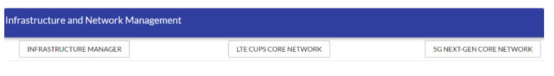

5. Click on the `CREATE` Button and Fill fields as below:


6. Click on the `SAVE` Button, then web pages return back with success. And the whole registered edge services display as:


7. Repeat the steps for `CREATE` and `SAVE`. for new edge service registration with OAM configuration parameters.

### Expected Outcome

The expected web pages should contain two edge services as below:


## ITP/ONP/5/03 : PATH and Delete AF services with OAM through UI interface

### Test Summary

The test covers edge service Patch and delete.  The registration is based on REST API with PATCH and DELETE method.

### Prerequisites

1. OpenNESS 5G deployment successfully as in [ITP/ONP/5/01](#itponp51-deploy-openness-5g-in-onprem-mode)
2. PC with web browser has IP connection with edgeController
3. Edge Services creation successfully as in [ITP/ONP/5/02](#itponp52--register-af-services-with-oam-through-ui-interface)

### Test Steps

1. Open web browser on the PC with URL: http://[controller_IP]:3020/services with two edge services as in [ITP/ONP/5/02](#itponp52--register-af-services-with-oam-through-ui-interface)
2. Click on the `EDIT` Button for dnn_1 as below:

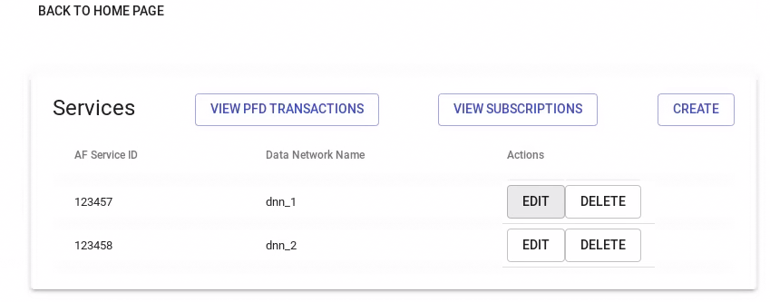

3. Update fields - DNN with “dnn_patch” as shown below:

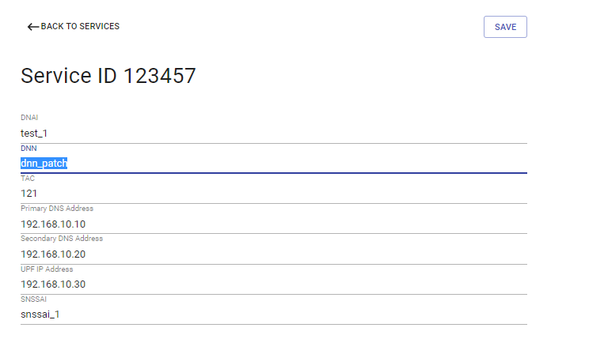

4. Click on the `SAVE` Button and web pages will return back to the all AF service lists as shown below:


5. Click on the `DELETE` Button to delete the one AF service.

### Expected Outcome:

The expected web pages should only contain one edge services as below:


Then click on the `DELETE` Button to delete the AF service. The the AF service list will be empty as shown below:

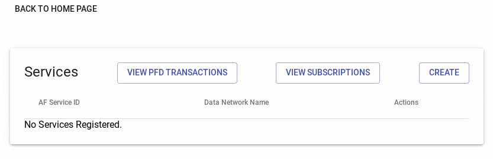

## ITP/ONP/5/04 : AF - Manage subscription for single UE with AF/NEF through UI interface

### Test Summary

Test the subscription of a traffic influence for a single UE towards the PCF

### Prerequisites

1. OpenNESS 5G deployment successfully as in [ITP/ONP/5/01](#itponp51-deploy-openness-5g-in-onprem-mode)
2. PC with web browser has IP connection with edgeController

### Test Steps

1. Open web browser on the PC with URL: http://[controller_IP]:3020/subscriptions, or click on `VIEW SUBSCRIPTION button`. The subscription list is empty as shown below:

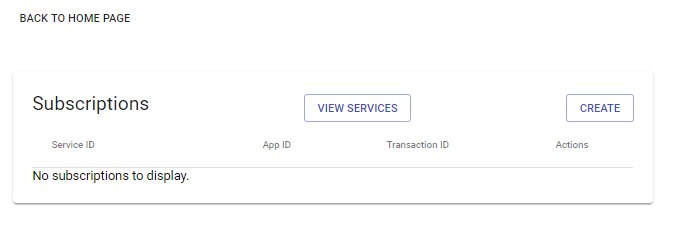

2. Click on `CREATE` button and Fill in subscriptions parameters and `SAVE`  as below:

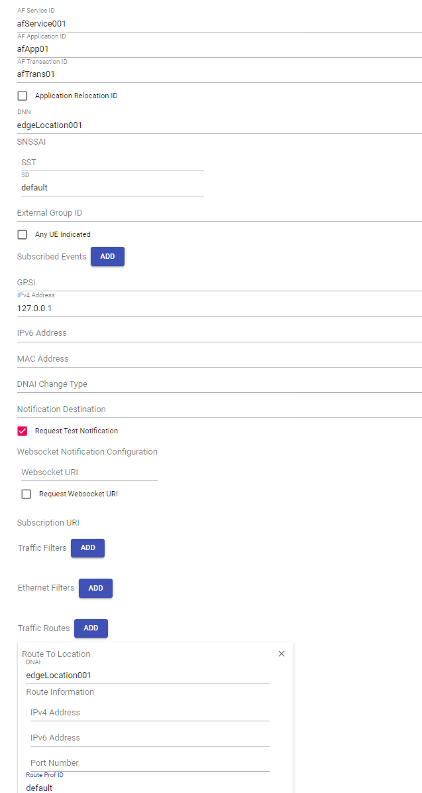

3. Subscriptions list shown as below:

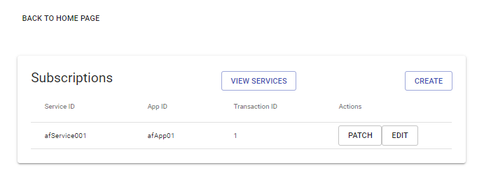

4. Click on  `PATCH` button to to change dnai from edgeLocation001 to edgeLocation002 as shown below:

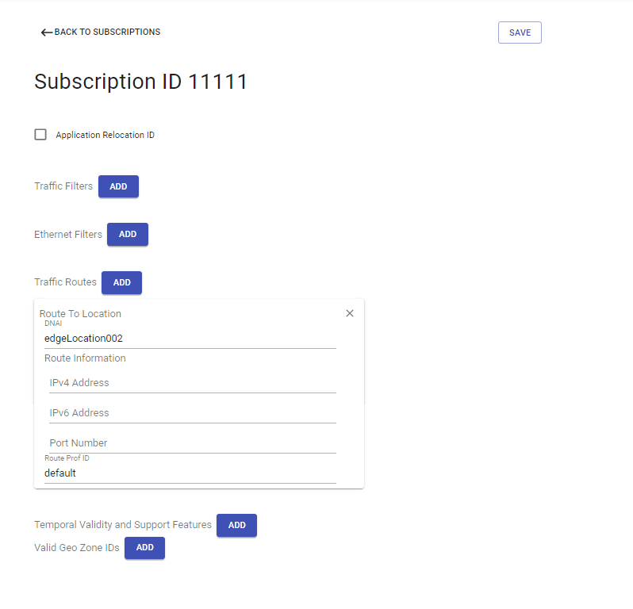

5. Click on `SAVE`. The webpage will return back to subscription list successfully.  Then Click on the `EDIT` button. You can get the subscription parameters as shown below:


6. Then Click on the DELETE SUBSCRIPTION button. The subscription list will be empty.

### Expected Outcome

The final expected web pages should show as below:


## ITP/ONP/5/05 : AF - Manage subscription of anyUE/group of UE with AF/NEF through UI interface

### Test Summary

Test the subscription of a traffic influence for any UE or group of UE towards the UDR.

### Prerequisites

1. OpenNESS 5G deployment successfully as in [ITP/ONP/5/01](#itponp51-deploy-openness-5g-in-onprem-mode)

2. PC with web browser has IP connection with edgeController

3. Add subscriptions as in [ITP/ONP/5/04](#itponp54--af---manage-subscription-for-single-ue-with-afnef-through-ui-interface)

### Test Steps

1. Open web browser on the PC with URL: http://[controller_IP]:3020/subscriptions, or click on `VIEW SUBSCRIPTION` button. The subscription list is empty as shown below:

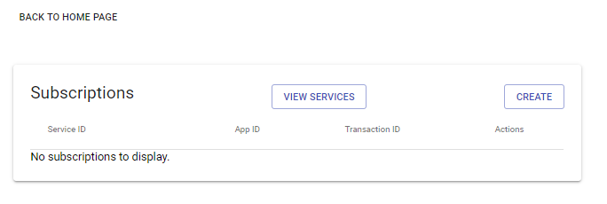

2. Click on CREATE button and Fill in subscriptions parameters for **anyUE/group of UE** and `SAVE`  as below:


3. Click on the `SAVE` Button with subscription list as below:


4. Click on the `PATCH` Button with changed parameters as below:


5. After Click on the `SAVE` Button, the web page will return back to subscription list. Then Click on  `EDIT` , the **subscription parameters** shown as below:


6. Click on the **DELETE SUBSCRIPITION** Button. The subscription will be empty

### Expected Outcome

The expected web pages  with empty subscription list should show as below:


## ITP/ONP/5/06 : AF - Manage PFD transaction of UE with AF/NEF through UI interface

### Test Summary

Test the transaction of Packet flow description from AF towards the UDR via NEF.

### Prerequisites

1. OpenNESS 5G deployment successfully as in [ITP/ONP/5/01](#itponp51-deploy-openness-5g-in-onprem-mode)

2. PC with web browser has IP connection with edgeController

### Test Steps

1. Open web browser on the PC with URL: http://[controller_IP]:3020/pfd, or click on `VIEW TRANSACTION` button. The PFD transaction list is empty as shown below:


2. Click on CREATE button and Fill in PFD transaction parameters and `SAVE`  as below:


3. PFD transaction list as shown below:


4. Click on `Edit` button to edit the transaction and edit the PFD as below :


5. Cick on SAVE. The webpage will return back to PFD transaction list successfully.


7. Click `Delete` to delete the transaction

### Expected Outcome

The expected web pages  with empty transaction list should show as below:


## ITP/ONP/5/07 : AF - Manage PFD transaction applicationID with AF/NEF through UI interface

### Test Summary

Test the PFD transaction application ID specific edit and delete.

### Prerequisites

1. OpenNESS 5G deployment successfully as in [ITP/ONP/5/01](#itponp51-deploy-openness-5g-in-onprem-mode)

2. PC with web browser has IP connection with edgeController.

### Test Steps

1. Follow the test step 1 to 3 from  [ITP/ONP/5/06](#itponp56--af---manage-pfd-transaction-of-ue-with-afnef-through-ui-interface)

2. Select an application ID and click Edit button as shown below.

   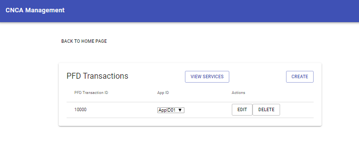

3. Edit the PFD's of the selected Application ID as shown below and Click Save.

   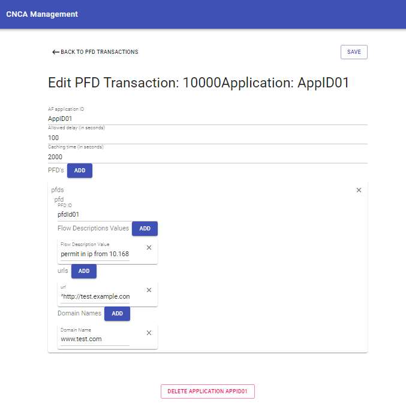

4. Select AppID01 from the drop down menu and click `Delete` to delete the application

    

5. Now click the `Edit` button the check the application ID in the transaction.

  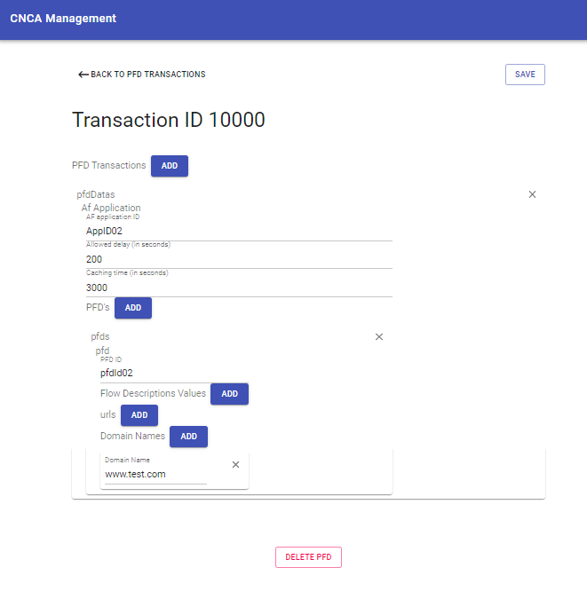

6. Click `Delete` to delete the application

### Expected Outcome

The expected web pages  with empty transaction list should show as below:


