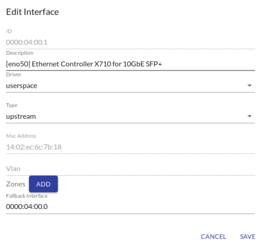
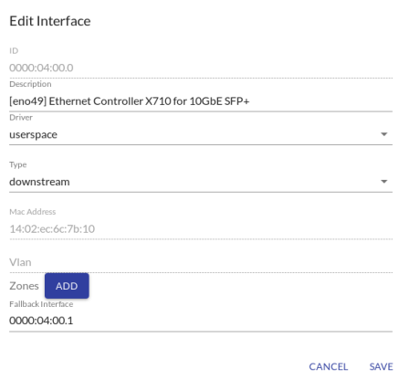

```text
SPDX-License-Identifier: Apache-2.0
Copyright © 2020 Intel Corporation
```

# ITP/ONP/03: On-Premise OpenVINO

Original definition: https://openness.atlassian.net/wiki/spaces/INTEL/pages/50495549/ITP+2019+12+ONP+3+On-Premise+OpenVINO+Test+Suite

## ITP/ONP/03/01: Verify OnPrem mode configuration with OpenVINO traffic

### Test summary

Verfiy OnPrem configuration

### Prerequisites

- Clean CentOS 7 machine or VM for OnPrem EdgeController
- Clean CentOS 7 machine for OnPrem EdgeNode
- One machine or VM with physical network interface passed through for OpenVINO client role
- One machine or VM with physical network interface passed through for gateway role
- OnPrem OpenNESS platform ready as described by [ITP/ONP/01/01](https://github.com/otcshare/native-on-prem/test/blob/master/itp/onp/ts01-platform-setup.md#itponp0101-deploy-edge-controller-in-onprem-mode) and [ITP/ONP/01/02](https://github.com/otcshare/native-on-prem/test/blob/master/itp/onp/ts01-platform-setup.md#itponp0102-deploy-and-enroll-edge-node-in-onprem-mode)

### Test steps

1. Pick separate unused network interfaces on EdgeNode and on OpenVINO client machine and connect to each other
2. Connect the second physical network interface on EdgeNode to separate physical NIC port (bound to VM or host) for gateway role
3. Set IP address on OpenVINO client machine interface: `ip addr add 192.168.10.10/24 dev eno50`
4. Using EdgeController UI create traffic policies:
  - **to_ENB** policy with:
      - Priority: 1
      - Destination
          - IP Filter Address:  192.168.10.10 (OpenVINO client address)
          - IP Filter Mask: 32
      - Target action: accept
  - **to_DP** policy with:
      - Priority: 1
      - Source
          - IP Filter Address:  192.168.10.10 (OpenVINO client address)
          - IP Filter Mask: 32
      - Target action: accept
  - **openvino** policy with:
      - Priority: 99
      - Source
          - IP Filter Address:  192.168.10.10 (OpenVINO client address)
          - IP Filter Mask: 24
      - Destination
          - IP Filter Address: 192.168.10.11 (OpenVINO app address)
          - IP Filter Mask: 24
          - Protocol: all
      - Target action: accept
    
5. Go to Interfaces tab in controller UI and add policies for interfaces:
  - Interface connected directly to OpenVINO client machine port (eg. 0000:04:00.1):
      - Add **to_ENB** policy
      - Edit interface:
    
      
      
      Note: Fallback interface address is the one defined below
      
  - Interface connected to external machine used for NTS traffic learning  (eg. 0000:04:00.0)
      - Add **to_DP** policy
      - Edit interface:
    
      
     
6. Apply changes to start NTS
7. Download OpenVINO example apps from https://github.com/otcshare/native-on-prem/edgeapps (edgeapps will be in native-on-prem in the future)
8. Build producer and consumer images
9. Deploy OpenVINO producer and consumer apps using EdgeController UI
10. Start producer and consumer applications (in that order)
11. Add **openvino** traffic policy to consumer app
12. Log in to consumer container `docker exec -it <consumer_container_id> /bin/sh` and modify `analytics.opennessentry` in `/etc/hosts` with IP address set in step 3 (separate interface on OpenVINO client machine/VM)
13. Setup interface
  ```shell
  root@14214534c051:~# ip link set dev vEth2 arp off
  root@14214534c051:~# ip a a 192.168.10.11/24 dev vEth2
  root@14214534c051:~# ip link set dev vEth2 up
  root@14214534c051:~# wget 192.168.10.10 -Y off
  ```
14. Exit from container and check if NTS configured KNI interfaces correctly:
  
  
15. Download clientsim on OpenVINO client machine/VM

16. Modify rtp endpoint to IP address of OpenVINO consumer app container or add openvino.openness domain to /etc/hosts file and set to 192.168.10.11 (OpenVINO consumer app IP address)

17. Set arp on OpenVINO clientsim machine using command
`arp -s 192.168.10.11 f2:6c:29:2b:06:e6`
where `f2:6c:29:2b:06:e6` is MAC address of consumer app container interface

18. Build clientsim image

19. Run `run_docker.sh` script on OpenVINO client to start video stream. Graphical user environment is required to observe the result stream with objects outlined


## ITP/ONP/03/02: Verify OpenVINO Sample in On-Premise & HDDL Scenario

### Test summary

Verfiy the OpenVINO sample app in the On-Premise mode with HDDL support enabled

### Prerequisites

- Clean CentOS 7 machine or VM for OnPrem EdgeController
- Clean CentOS 7 machine with the HDDL device installed for OnPrem EdgeNode
- One machine or VM with physical network interface passed through for OpenVINO client role
- One machine or VM with physical network interface passed through for gateway role
- OnPrem OpenNESS platform ready as described by [ITP/ONP/01/01](https://github.com/otcshare/native-on-prem/test/blob/master/itp/onp/ts01-platform-setup.md#itponp0101-deploy-edge-controller-in-onprem-mode) and [ITP/ONP/01/02](https://github.com/otcshare/native-on-prem/test/blob/master/itp/onp/ts01-platform-setup.md#itponp0102-deploy-and-enroll-edge-node-in-onprem-mode) (+enabling `role: hddl`) 

### Test steps

1. Platform deployment
  - Deploy Edge Controller as described in [ITP/ONP/01/01](https://github.com/otcshare/native-on-prem/test/blob/master/itp/onp/ts01-platform-setup.md#itponp0101-deploy-edge-controller-in-onprem-mode) test case
  - Deploy and enroll Edge Node as described in [ITP/ONP/01/02](https://github.com/otcshare/native-on-prem/test/blob/master/itp/onp/ts01-platform-setup.md#itponp0102-deploy-and-enroll-edge-node-in-onprem-mode) test case, with addition of `role: hddl` in `onprem_node.yml` file.
2. OpenVINO verification
  - Execute test instructions defined in ITP/2019/12/ONP/3/1 test case with following differences:
    1. Build/Edit the Dockerfile (`edgeapps/openvino/producer/Dockerfile`) used for OpenVINO **producer** image with the following: 
    `ENV OPENVINO_ACCL=CPU_HDDL`
    2. When deploying **consumer** app using EdgeController UI add EPA Feature Key and EPA Feature
       Value: Key = `hddl` , value = `true`
3. HDDL verification
  - HDDL service container is running: `docker ps | grep hddlservice`
  - The hddl service application is running correctly - information about VPU utilization will show up in a form of a table (from hddlservice logs).
  - The consumer application pod has access to `/dev/ion` and `/var/tmp/hddl_service.sock`
  - Myriad X devices are visible from `/dev` on Edge Node
  - The video coming back to Client Simulator changes detection from CPU to HDDL every 2 minutes (FPS change will be noticed between pedestrian detection on CPU and HDDL)

